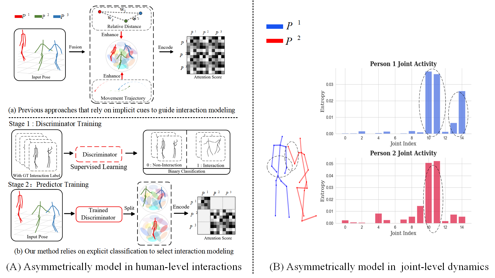

# AsymFormer: Asymmetric Interaction-Joints Dynamics Transformer for Multi-Person 3D Pose Forecasting



## Abstract
Multi-person pose forecasting has garnered increasing attention due to its critical role in applications such as human-robotic interaction, and autonomous systems. Existing methods have made notable progress by incorporating interaction-aware mechanisms to capture relational dynamics. However, they often suffer from two key limitations: (1) the implicit assumption that all individuals in a scene are socially relevant, and (2) the uniform treatment of all joints regardless of their activity level or importance in motion representation. To overcome these challenges, we propose a novel Transformer-based architecture, AsymFormer, designed to asymmetrically model both human-level interactions and joint-level dynamics. At the human level, we introduce a Selective Interaction-Aware Module (SIAM), which leverages a discriminator pre-trained on ground-truth interaction labels to assess each individual's social relevance from historical trajectories. This allows the model to explicitly focus on meaningful interactions while ignoring socially irrelevant agents. At the joint level, we design a Targeted Joints Dynamic Encoder (TJDE) to emphasize high-activity joints, avoiding the dilution of informative signals caused by treating all joints equally. This selective focus enhances motion representation. Extensive experiments on multiple datasets are conducted to suggest that our method significantly surpasses the state-of-the-art methods.

## Overview


```
your_project_folder/
├── data/
│   ├── mix
│   │   ├── mix1_6persons.npy
│   │   ├── mix2_6persons.npy
│   ├── mocap
│   │   ├── test_3_75_mocap.npy
│   │   ├── train_3_75_mocap.npy
│   ├── mupots3d
│   │   ├── mupots_2_150_mocap.npy
│   │   ├── mupots_2_150_mocap.npy
│   ├── ...
├── Model
│   ├── short_model.py
│   ├── ...
├── data_short
├── metrics.py
├── test.py
├── train.py
```


## Requirements
- python==3.6
- pytorch==1.10.0
- dct==0.1.6
- numpy==1.19.2

- ## Training
`python train.py`

## Evaluation
`python test.py`
